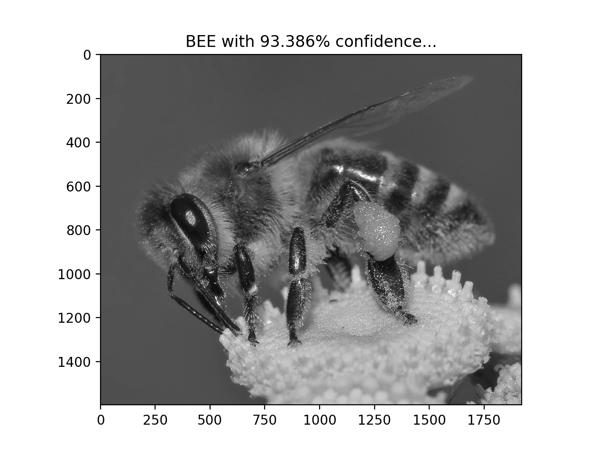
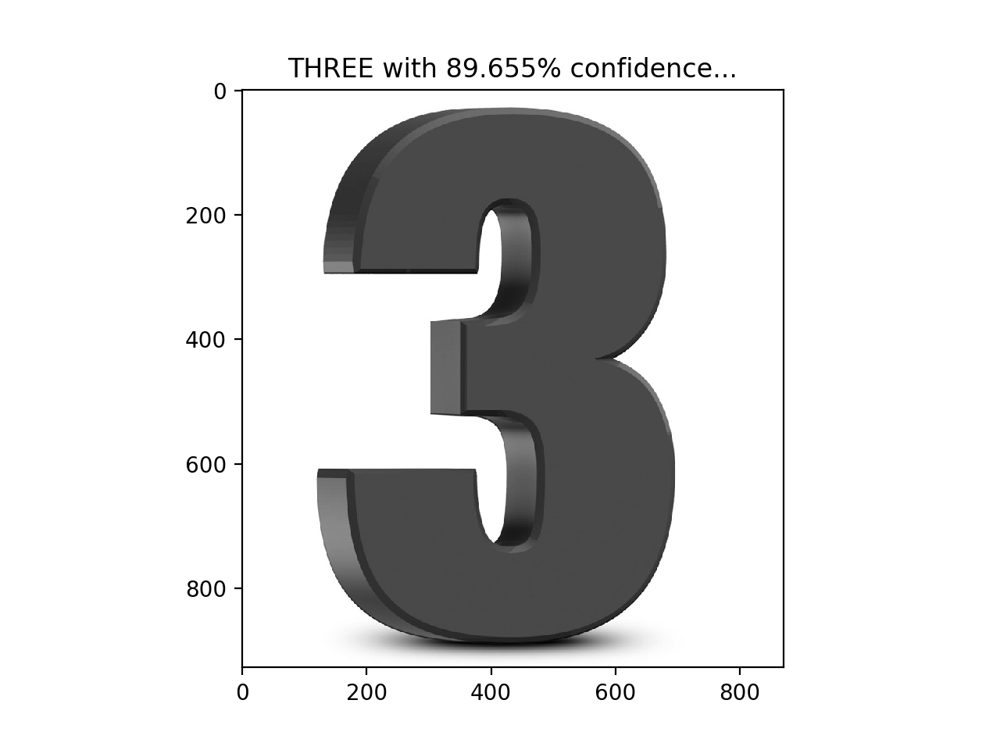
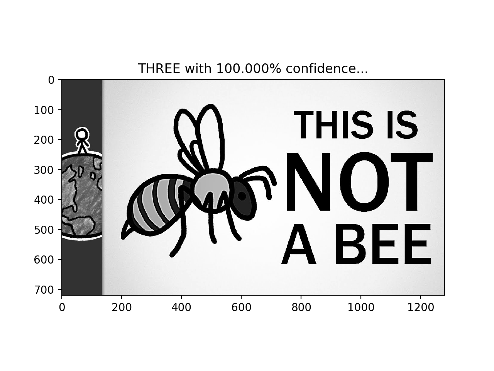

# Bees and 3s


#### A very simple Tensorflow implementation of a neural network that classifies bees and 3s. So useful.
### Setup:
```
git clone https://github.com/jakegrigsby/Bees-and-3s.git
python predict.py *url for your image here*
```



### (Re)train:
 The 3s dataset comes packaged with Tensorflow, but you'll need some bee pictures from [kaggle](https://www.kaggle.com/jenny18/honey-bee-annotated-images). Download the dataset and unzip `bee_imgs.zip` and place the newly created `bee_imgs` folder in the `data` folder of this repo. Then: 
```
    python setup.py
    python train.py
```
 This should only take a few minutes to run (it's a very small model) and will overwrite the saved weights in the `models` folder.

-----------------------------------------------------------
## It can't be fooled:

