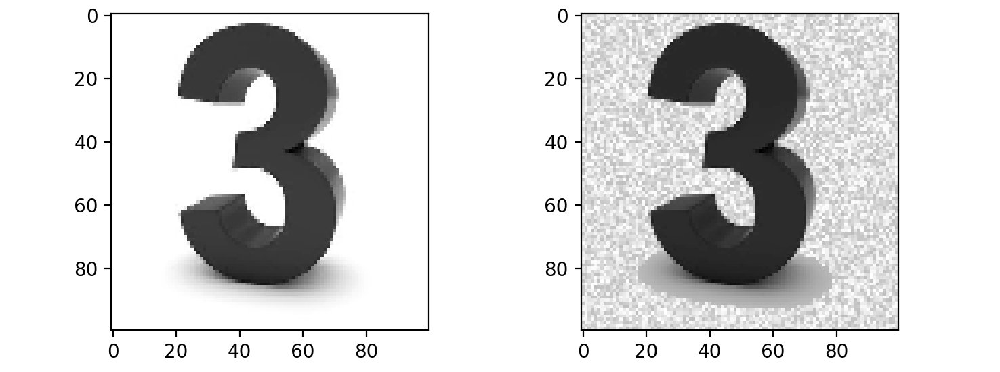

# Bees and 3s


#### A very simple Tensorflow implementation of a neural network that classifies bees and 3s. So useful.
### Setup:
```
git clone https://github.com/jakegrigsby/Bees-and-3s.git
python predict.py *url for your image here*
```


### (Re)train:
The script I use to load and resize the data is included (`setup.py`), but the raw images are too big to include. I've uploaded the output of the setup script - a numpy file holding the processed images and their labels - [here](https://virginia.box.com/s/c10ct4laxstyovwqf0s7633vk87cw1hk). Once that's in the `data` folder, all you need to do is make your changes and run `train.py`.


### Noise
This version adds random noise generation to the image augmentation pipeline. This is just something I've been messing around with and needs some more development. I noticed that the network was basically cheating by looking to see if there was a background to the image -  a background meant bee and blank meant three. That pretty much works for the dataset I made, but it meant the network was getting tricked by bees on white backdrops and threes with something else going on in the image. The idea is that, by adding noise to flat white and black backgrounds, we are helping the network deal with those edge cases by removing the handicap. We are making it better by making its task significantly harder. Here's a demo of the noise generating function (`random_noise.bg_noise_tf`):


